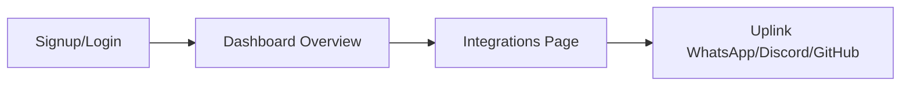
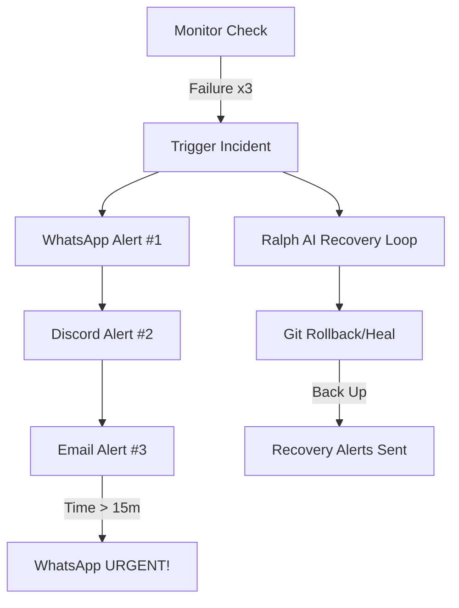

# 🛡️ Upbase Monitoring & Ralph AI: Master Systems Documentation

This is the **Ultimate Technical Manual** for your monitoring project. It covers every single layer from the database to the front-end buttons, explaining the "Why" and "How" of every piece.

---

## 🏛️ 1. Project Concept & Goal

**The Goal**: To build an "Unstoppable Watcher" that doesn't just alert you when a website breaks, but **fixes it automatically** (Ralph AI) while communicating through stable, human-like **WhatsApp messages**.

**The Problems We Solved:**
1.  **Email Overload**: We moved from noisy emails to tiered escalations.
2.  **WhatsApp Bans**: We built a "Human-Simulation" engine to prevent number bans.
3.  **Delayed Recovery**: We built the **Ralph Loop** for autonomous self-healing.

---

## 💻 2. The Full Technology Stack

| Layer | Technology | Purpose |
| :--- | :--- | :--- |
| **Frontend** | React (Vite) | High-speed, interactive user interface. |
| **Styling** | Tailwind CSS | Sleek, modern, and ultra-responsive layout. |
| **Logic** | Node.js (Express) | The backend "Brain" that handles requests. |
| **Database** | MongoDB | Stores user accounts, monitors, and alerts. |
| **Real-time** | Polling/Queue | Ensures we check sites every 60 seconds precisely. |
| **Automation** | Puppeteer | Runs the WhatsApp engine in a headless browser. |

---

## ⚙️ 3. The Backend Engine (The Core)

### A. The Monitoring "Heartbeat"
*   **The Logic**: Every 60 seconds, the backend wakes up and pings every URL in the list.
*   **Safety Gate**: We don't alert on the first failure. The system must see **3 consecutive failures** (3 minutes of downtime) before triggering the alert. 
*   **Why?** This prevents "Blinking" alerts caused by tiny network glitches.

### B. The Tiered Alerting System (SLA)
Instead of a single alert, we use a **Chain of Command**:
1.  **Level 1 (1m)**: 📱 WhatsApp Ping (Direct & Fast).
2.  **Level 2 (3m)**: 📟 Discord Webhook (Team Channel).
3.  **Level 3 (5m)**: 📧 Email Dispatch (Official Archive).
4.  **Level 4 (15m)**: 🚨 WhatsApp Urgent Escalation (Emergency).

---

## 🛡️ 4. Advanced Technical Pro Features

### A. WhatsApp Anti-Ban (Human Sim) 🧠
To WhatsApp, your bot looks like a real person. 
*   **Thinking Latency**: Waits 2-5 seconds randomly as if "reading" the screen.
*   **State Simulation**: We trigger the `sendStateTyping()` command so you see "typing..." on your phone.
*   **Unique Jitter**: We add a code like `Ref: [x8j2]` at the bottom. This prevents WhatsApp's "Duplicate Text" detection from banning you.

### B. Idempotency (Gated Notifications) 🚦
This is a critical algorithm. The system "remembers" what it already sent. 
*   If your site is down for 30 minutes, you won't get 30 WhatsApp messages.
*   You will get exactly **ONE** at 1m, **ONE** at 3m, **ONE** at 5m, and **ONE** at 15m. 

### C. Ralph Intelligence & AI (Self-Heal) 🤖
When a site is `DOWN`, Ralph doesn't wait for you. It:
1.  **Analyzes (Intelligence)**: Figure out why it failed (e.g. 500 error vs. 404).
2.  **Pattern Match**: Checks recent deployments and latency spikes.
3.  **RCA**: Looks at your most recent GitHub commits.
4.  **Remediates**: Triggers a **Git Rollback** to a safe version.
5.  **Verifies**: Pings the site again to confirm it's fixed.

---

## 📜 5. Main Workflows (The User Journey)

### 1. Account Onboarding

### 2. Incident Lifecycle

---

## 📊 6. Database Schema Design (Simple)

*   **Users**: Email, Password (hashed), OAuth tokens.
*   **Monitors**: URL, Status (`UP`/`DOWN`), `alertLevel` (for Idempotency), response times.
*   **Integrations**: 
    *   **Discord**: Webhook URL.
    *   **GitHub**: Encrypted PAT Token, Default Username.
    *   **WhatsApp**: Session token (stored in disk) for persistence.

---
_Upbase Monitoring v1.0.0 Alpha - A Deep System Documentation_
