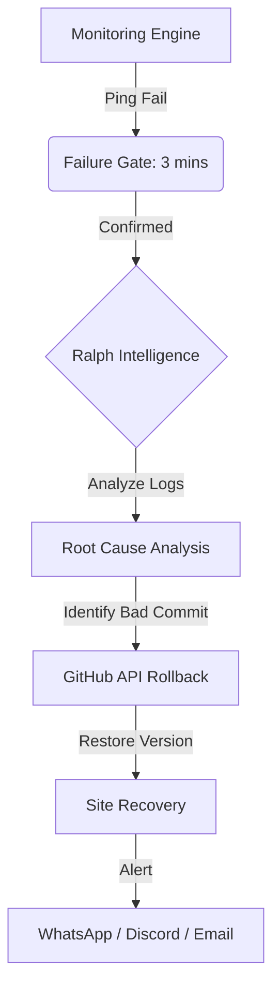

# 🛡️ Upbase Monitoring: Guardian of the Fleet

[](https://github.com/upbasmonitoring/upbase-monitoring-)
[](LICENSE)
[](https://github.com/upbasmonitoring)

**Upbase Monitoring** (Sentinel IQ) is an AI-powered observability and self-healing platform designed to eliminate the delay between a website breaking and a developer fixing it. It automates the "Oh No!" moment by detecting failures and initiating autonomous remediation.

---

## 🚀 Key Features

### 🌐 Global Monitoring & Observability
*   **24/7 Uptime Tracking**: Constant pings to monitor availability across global endpoints.
*   **Performance Metrics**: Real-time tracking of Response Time (TTFB), Error Rates, and SSL certificate health.
*   **SLIs & SLOs**: Automated Service Level Indicator tracking to ensure your platform meets its reliability goals.

### 🧠 Ralph Intelligence Engine (RCA)
*   **Root Cause Analysis**: Our custom AI engine, Ralph, analyzes every failure to determine the "Why, What, and How."
*   **Intelligent Diagnostics**: Distinguishes between network jitter, "Ghost Failures," and critical server-side errors.

### ⚡ Self-Healing & Remediation
*   **Automated Git Rollbacks**: Integrates with GitHub REST API to trigger instant code rollbacks when a "Bad Deploy" is detected.
*   **Autonomous Fixes**: Ralph doesn't just alert; it takes action to restore service immediately.

### 📱 Multi-Channel Smart Alerts
*   **Interactive WhatsApp Bot**: A human-like bot that provides status updates and allows manual triggers (`STATUS`, `ROLLBACK`) directly from your phone.
*   **Tiered Escalation**: Automatic escalation flow: **WhatsApp → Discord → Email**, based on downtime duration.
*   **Anti-Ban Engine**: Advanced simulation of "Human Thinking" states to protect your WhatsApp number from being flagged.

---

## 🛠️ Tech Stack

### Frontend
- **Framework**: React.js with Vite
- **Styling**: Tailwind CSS & Framer Motion
- **UI Components**: Shadcn UI & Lucide Icons
- **State Management**: React Context & Hooks

### Backend
- **Runtime**: Node.js & Express.js
- **Database**: MongoDB (Mongoose)
- **Real-time**: WebSocket & Redis (Caching)
- **Integrations**: GitHub API, WhatsApp-web.js (Puppeteer), Nodemailer (SMTP)

---

## 🏗️ Architecture Flow



---

## ⚙️ Getting Started

### Prerequisites
*   Node.js (v18+)
*   MongoDB (Compass or Atlas)
*   GitHub Personal Access Token (for rollbacks)
*   WhatsApp account (for alert bot)

### Installation

1. **Clone the repository:**
   ```bash
   git clone https://github.com/upbasmonitoring/upbase-monitoring-.git
   cd upbase-monitoring-
   ```

2. **Setup Backend:**
   ```bash
   cd backend
   npm install
   cp .env.example .env
   # Update your API keys, MongoDB URI, and GitHub tokens in .env
   npm start
   ```

3. **Setup Frontend:**
   ```bash
   cd ../frontend
   npm install
   npm run dev
   ```

---

## 🌿 Branching Strategy

Our repository follows a strict internal workflow to ensure stability:

*   **`main` Branch**: Reserved for **Stable Production** releases. Only verified and tested code is merged here.
*   **`master` Branch**: Used for **Upcoming Updates** and active development. Push your latest enhancements here first for testing.

---

## 🔐 Security
*   **JWT Authentication**: Secure user session management across the platform.
*   **Token Encryption**: All GitHub access tokens are encrypted using AES-256 before being stored.
*   **Security Shield**: Implemented Helmet.js and custom RBAC (Role-Based Access Control) middleware.

---

## 📜 License
Distributed under the MIT License. See `LICENSE` for more information.

---

## 🤝 Contact
**Project Link**: [https://github.com/upbasmonitoring/upbase-monitoring-](https://github.com/upbasmonitoring/upbase-monitoring-)
**Organization**: [Upbase Monitoring](https://github.com/upbasmonitoring)
